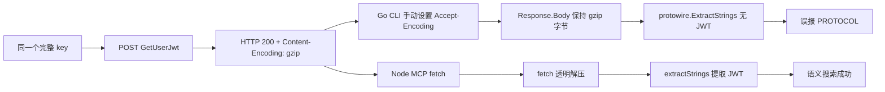

# fast-context CLI `GetUserJwt` gzip 兼容修复技术方案

## 1. 文档信息

| 项目 | 内容 |
| --- | --- |
| 文档状态 | 已实施，待发布 |
| 问题范围 | Go CLI 语义搜索认证链路 |
| 影响版本 | 已确认 `0.1.1` |
| 建议修复版本 | `0.1.2` |
| 编写日期 | 2026-07-21 |
| 实施验证日期 | 2026-07-21 |
| 关联任务 | Codex 会话 `019f83f0-0f0e-7420-acca-6beb81ece00f` |
| 关联文档 | [fast-context Go CLI 技术架构方案](./fast-context-go-cli-architecture.md) |

## 2. 结论

CLI 语义搜索失败不是 key 未配置、配置优先级错误或 key 本身不可用，而是 Go CLI 对 `GetUserJwt` 的 gzip HTTP 响应处理错误。

当前 `internal/windsurf/client.go` 在 unary 请求中手动设置：

```http
Accept-Encoding: gzip
```

Go `net/http.Transport` 只有在它自行添加该请求头时才会透明解压 gzip 响应；调用方手动添加后，`Response.Body` 保持压缩状态。`FetchJWT` 随后把 gzip 字节直接交给 `protowire.ExtractStrings`，自然无法找到以 `eyJ` 开头的 JWT，最终返回：

```text
PROTOCOL: failed to extract JWT from GetUserJwt response
```

同一个 key 在 `fast-context-mcp@1.5.2` 中可以工作，是因为 Node.js `fetch` 会在读取响应体时完成 HTTP gzip 解压。受控探针已在全新 Node 进程中验证该行为，因此 MCP 成功并非来自旧 JWT 缓存。

推荐采用最小修复：从 Go unary 请求中移除手动 `Accept-Encoding`，让标准 `http.Transport` 负责 gzip 协商和透明解压；不修改凭据解析、protobuf schema、JWT 提取规则或搜索编排。

## 3. 问题现象与证据

### 3.1 会话复现结果

指定会话中的真实 CLI 测试已确认：

1. 全局 CLI 版本为 `fast-context 0.1.1`。
2. `doctor --format json` 返回 `credentials.ok=true`。
3. `credentials.source_type=fast_context_config`，证明 CLI 已读取 `$HOME/.config/fast-context/config.json`。
4. `search` 在 `Fetching JWT...` 阶段失败，未进入 rate-limit 检查和远端语义搜索回合。
5. 两次真实请求均返回同一个 `PROTOCOL` 错误。

因此，下列方向已被排除：

| 排除项 | 依据 |
| --- | --- |
| `.config` 文件未生效 | `doctor` 明确报告 `fast_context_config` |
| CLI 未读取到 key | 已进入 `GetUserJwt` 请求并收到 HTTP 成功响应 |
| 项目路径或 `ripgrep` 不可用 | `doctor` 中对应检查均通过 |
| 搜索 payload 或 repo map 失败 | 错误发生在构建 repo map 和发送搜索上下文之前 |
| TLS、DNS 或 HTTP 鉴权状态失败 | 受控探针收到 `GetUserJwt` HTTP 200 |

### 3.2 当前 Go 调用链

```text
internal/search/search.go
  -> credentials.FindAPIKey()
  -> windsurf.Client.FetchJWT()
  -> windsurf.Client.unary(GetUserJwt)
  -> protowire.ExtractStrings(responseBody)
```

对应实现事实：

| 文件 | 当前行为 | 问题 |
| --- | --- | --- |
| `internal/search/search.go:47-54` | 解析 key 后立即调用 `FetchJWT` | 行为正确 |
| `internal/windsurf/client.go:64-85` | 从 unary 响应中提取 `eyJ...` JWT | 前提是响应体已完成 HTTP 解压 |
| `internal/windsurf/client.go:199-233` | 手动设置 `Accept-Encoding: gzip` 后直接 `io.ReadAll` | Go 不再自动解压，返回 gzip 字节 |
| `internal/protowire/protowire.go:69-113` | 按 protobuf wire format 扫描字符串 | 不负责 HTTP content encoding，无法解析 gzip 字节 |

### 3.3 同 key 受控认证探针

为排除 key 差异与 MCP 缓存，使用 `$HOME/.config/fast-context/config.json` 中同一 key，在全新 Node 进程中直接调用已安装的 `fast-context-mcp@1.5.2` 认证实现。探针只访问 `GetUserJwt`；后续请求在本地拦截为 429，没有发送 repo map、源码片段或搜索上下文。

探针结果：

```json
{
  "endpoint": "GetUserJwt",
  "status": 200,
  "content_encoding": "gzip",
  "content_type": "application/proto",
  "decoded_body_bytes": 1656,
  "decoded_prefix_hex": "0af5"
}
```

该结果证明：

- key 可被服务端接受；
- 服务端当前确实压缩 `GetUserJwt` 响应；
- 解压后的响应是 protobuf 数据，而不是 JSON 错误页或空响应；
- 全新 Node 进程中的 JWT cache 初始为空，因此 MCP 成功不依赖历史缓存。

### 3.4 Go 与 Node HTTP 语义差异

`fast-context-mcp@1.5.2/src/core.mjs` 与 Go CLI 构造的 `GetUserJwt` protobuf 元数据、endpoint 和主要请求头基本一致。关键差异位于 HTTP runtime：

| 行为 | Node.js `fetch` | Go `net/http.Transport` |
| --- | --- | --- |
| 调用方设置 `Accept-Encoding: gzip` | 读取响应体时自动解压 | 不自动解压 |
| runtime 自行设置 `Accept-Encoding: gzip` | 自动解压 | 自动解压，并标记 `Response.Uncompressed=true` |
| 当前实现结果 | `extractStrings` 收到 protobuf | `ExtractStrings` 收到 gzip 字节 |

Go 1.25 标准库 `GOROOT/src/net/http/transport.go` 对此有明确约定：仅当 `Transport` 自行请求 gzip 时透明解压；用户显式请求 gzip 时不自动解压。

## 4. 根因分析

### 4.1 失败流程



### 4.2 根因定级

| 层级 | 判断 |
| --- | --- |
| 直接原因 | `unary` 手动声明 gzip，却没有手动解压响应 |
| 设计原因 | 从 Node 实现迁移协议时复用了请求头，但没有同步核对 Go HTTP runtime 的解压语义 |
| 测试缺口 | `client_test.go` 只返回未压缩 protobuf，没有覆盖真实服务端的 gzip 响应 |
| 诊断缺口 | HTTP 200 的压缩字节被下游统一归类为 JWT protobuf 解析失败，错误信息掩盖了 content encoding 问题 |

### 4.3 非根因

以下机制不应在本次修复中调整：

- `$HOME/.config/fast-context/config.json` 的位置与 schema；
- `FAST_CONTEXT_KEY`、本地 JSON、`WINDSURF_API_KEY`、本地自动发现的优先级；
- `devin-session-token$<JWT>` 完整性检查；
- `GetUserJwt` endpoint、Windsurf app version 和 language-server version；
- `protowire.ExtractStrings` 的 JWT 前缀判断；
- repo map、bootstrap、hotspot、restricted executor 等搜索逻辑。

## 5. 目标与非目标

### 5.1 目标

- CLI 能正确处理 `GetUserJwt` 的 gzip 和未压缩 protobuf 响应。
- 保持现有凭据来源、CLI 参数、输出格式和错误码契约。
- 用自动化测试固定 Go HTTP compression ownership，防止再次引入手动 header。
- 修复后的 CLI 使用与 MCP 相同的有效 key 时可以完成真实语义搜索。
- 全流程不记录或输出 API key、JWT、响应体和 credential source path。

### 5.2 非目标

- 不新增 `config set/init` 或修改本地配置文件写入能力。
- 不把 `devin-session-token$` 后的 JWT 直接当作 `GetUserJwt` 返回值使用；上游 MCP 仍通过认证接口换取 JWT，两者语义不能假定等价。
- 不为短生命周期 CLI 引入进程内 JWT cache；受控探针已排除 cache 是本问题差异来源。
- 不修改 MCP server、Codex 配置或已安装的 `fast-context-mcp`。
- 不新增 `FC_INSECURE_TLS` fallback；HTTP 200 已证明 TLS 不是当前阻塞点。
- 不重构整个 Windsurf client 或 protobuf 层。

## 6. 修复方案

### 6.1 推荐方案：由 `http.Transport` 管理响应压缩

修改 `internal/windsurf/client.go` 的 `unary`：

```diff
 req.Header.Set("Content-Type", "application/proto")
 req.Header.Set("Connect-Protocol-Version", "1")
 req.Header.Set("User-Agent", "connect-go/1.18.1 (go1.25.5)")
-req.Header.Set("Accept-Encoding", "gzip")
 if compress {
     req.Header.Set("Content-Encoding", "gzip")
 }
```

预期行为：

1. 生产代码使用的 `defaultHTTPClient` 基于 `http.DefaultTransport.Clone()`。
2. 请求未显式设置 `Accept-Encoding` 时，标准 `Transport` 自动添加 `gzip`。
3. 收到 `Content-Encoding: gzip` 后，`Transport` 自动解压 `Response.Body`。
4. `unary` 继续只返回已解压的 protobuf bytes。
5. `FetchJWT` 无需修改即可提取 JWT。

该方案同时覆盖：

- `GetUserJwt` 的未压缩请求、gzip 响应；
- `CheckUserMessageRateLimit` 的 gzip 请求、gzip 或未压缩响应；
- 未来其他复用 `unary` 的接口。

### 6.2 保持不变的 header

| header | 处理 | 原因 |
| --- | --- | --- |
| `Content-Type: application/proto` | 保留 | unary protobuf 契约 |
| `Connect-Protocol-Version: 1` | 保留 | Connect-RPC 契约 |
| `User-Agent` | 保留 | 现有协议兼容信息 |
| `Content-Encoding: gzip` | `compress=true` 时保留 | 描述请求体压缩，与响应解压无关 |
| `Stream` 中的 `Accept-Encoding: identity` | 保留 | streaming path 需要按 Connect frame 处理 payload compression，不属于本次 unary bug |

### 6.3 不推荐方案

| 方案 | 不推荐原因 |
| --- | --- |
| 保留 header 并在 `unary` 手动 `gzip.NewReader` | 与标准库重复；还需处理大小限制、损坏流、重复/组合 encoding 和 response header 归一化 |
| 从 key 的 `$` 后直接截取 JWT | 未证明与服务端换取的 session JWT 等价，偏离 MCP 真实认证流程 |
| 复制 MCP 的 JWT cache | 不能修复首次认证；CLI 单次进程缓存收益有限 |
| 放宽 `ExtractStrings` 扫描 gzip bytes | 层级错误；HTTP content encoding 必须在 protobuf 解析前完成 |
| 关闭服务端 gzip | 客户端不能控制上游长期行为，也无法保证其他 unary endpoint |

## 7. 文件级变更设计

| 文件 | 变更 | 必要性 |
| --- | --- | --- |
| `internal/windsurf/client.go` | 删除 unary 中手动设置的 `Accept-Encoding: gzip` | 核心修复 |
| `internal/windsurf/client_test.go` | 新增 gzip `GetUserJwt` 回归测试，并保留未压缩响应覆盖 | 防止回归 |
| `docs/fast-context-go-cli-architecture.md` | 在 Windsurf client 章节记录“响应压缩由 `http.Transport` 负责”的边界 | 固化架构约束 |

不需要修改：

- `internal/credentials/**`；
- `internal/config/**`；
- `internal/protowire/**`；
- `internal/search/**`；
- `README.md` 与 CLI contract；
- `go.mod`、`go.sum` 或 npm manifest。

## 8. 测试设计

### 8.1 单元测试

#### 用例 A：gzip JWT 响应

`httptest.Server`：

1. 构造包含测试 JWT 的 protobuf body。
2. 使用 `gzip.Writer` 压缩 body。
3. 返回 `Content-Type: application/proto`。
4. 返回 `Content-Encoding: gzip`。
5. 调用 `FetchJWT`。
6. 断言返回原始测试 JWT，且 error 为 `nil`。

该用例在当前实现下应失败，在删除手动 header 后应通过，是本次修复的核心回归测试。

#### 用例 B：未压缩 JWT 响应

保留现有 `TestFetchJWTAndHTTPErrorClassification`，确认未压缩服务端仍兼容，避免修复只适配 gzip。

#### 用例 C：HTTP 鉴权错误

保留 401/403 分类测试，确认 header 调整不会把 `AUTH_ERROR` 退化为 `PROTOCOL` 或 `NETWORK`。

### 8.2 本地验证

```powershell
mise exec -- go test ./internal/windsurf
mise exec -- go test ./internal/search ./internal/cli
mise exec -- go test ./...
mise exec -- go vet ./...
git diff --check
```

验证重点：

- gzip 与未压缩认证响应均通过；
- 搜索层测试不需要改写 mock 契约；
- 不新增依赖；
- 代码、测试和文档保持 UTF-8 无 BOM、LF；
- 工作区中不出现 key、JWT、认证响应体或真实 credential path。

### 8.3 真实 E2E

真实 E2E 会发送查询、repo map 和受限本地命令结果到 Windsurf。加载 `fast-context` Skill 且 `doctor --format json` 返回 `ok: true` 后，可直接使用最小测试：

```powershell
fast-context doctor --project <repo-root> --format json
fast-context search "where is CLI command dispatch implemented" `
  --project <repo-root> `
  --tree-depth 1 `
  --max-turns 1 `
  --max-commands 4 `
  --max-results 5 `
  --exclude .git `
  --exclude node_modules `
  --format json
```

验收条件：

- `doctor` 仍报告期望的 credential source；
- 日志越过 `Fetching JWT...` 和 `Checking rate limit...`；
- 命令返回至少一个有效文件路径，或返回业务层“无匹配结果”，但不能再出现 gzip 导致的 JWT `PROTOCOL` 错误；
- stdout/stderr 不包含 key、JWT 或完整认证响应。

## 9. 实施步骤

### M1：建立失败测试

- 在 `client_test.go` 新增 gzip JWT response fixture。
- 确认该测试在修改生产代码前稳定复现 `failed to extract JWT`。

### M2：实施最小修复

- 删除 unary 中手动 `Accept-Encoding: gzip`。
- 不引入手动解压 helper，不修改 `FetchJWT` 签名。
- 运行 Windsurf client 定向测试。

### M3：补齐共享路径验证

- 运行现有 rate-limit 与 HTTP 错误分类测试，确认共享 unary 路径没有回归。
- 运行 `internal/search`、`internal/cli` 和全量 Go 测试。
- 更新架构文档中的 HTTP compression ownership。

### M4：受控 E2E

- 用本地构建产物运行 `doctor`。
- 在 Skill 已加载且 `doctor` 通过后执行单轮、无 snippets 的真实搜索。
- 对比修复前后的阶段日志和结构化结果。

### M5：发布

- 当前 `0.1.1` 已发布，npm 版本不可覆盖，修复应使用新 patch 版本 `0.1.2`。
- 完成代码、测试、文档与 E2E 后，再执行：

```powershell
pwsh ./.deploy/release-version.ps1 0.1.2
```

- 脚本只准备本地 commit 与 tag；推送 `main` 和 `v0.1.2` 会触发外部发布，必须单独获得授权。

## 10. 风险与应对

| 风险 | 概率 | 影响 | 应对 |
| --- | --- | --- | --- |
| 上游返回未压缩响应 | 低 | 低 | 标准 `io.ReadAll` 直接读取，现有测试继续覆盖 |
| 上游继续返回 gzip | 高 | 高 | 由标准 `Transport` 自动协商和解压，新增真实形态回归测试 |
| 自定义 `RoundTripper` 禁用压缩 | 低 | 中 | 生产 client 使用 `http.DefaultTransport.Clone()`；测试使用标准 transport seam |
| streaming path 被误改 | 低 | 高 | 明确只修改 `unary`；保留 `Stream` 的 `Accept-Encoding: identity` |
| 错把 key/JWT 写入日志 | 低 | 高 | 测试 fixture 使用假 JWT；E2E 只记录状态、encoding、长度和阶段，不记录 body |
| npm 误覆盖 `0.1.1` | 低 | 中 | 发布新版本 `0.1.2`，不复用已发布版本 |

## 11. 回滚方案

代码尚未发布时：

- 回退 `client.go`、`client_test.go` 和架构文档的本次改动即可；
- 不涉及配置迁移、数据迁移或依赖回退。

`0.1.2` 已发布后：

- npm 已发布版本不可覆盖；如发现新问题，修复后发布 `0.1.3`；
- 可临时把 npm `latest` 指回已知可用版本，但 `0.1.1` 已确认无法完成当前 gzip 认证，不能作为语义搜索可用性的长期回滚目标；
- MCP 路由未被本方案修改，可在 CLI 修复验证前继续作为临时语义搜索通道。

## 12. Definition of Done

- [x] 新增测试能在旧实现上复现 gzip JWT 解析失败。
- [x] unary 不再手动设置 `Accept-Encoding: gzip`。
- [x] gzip 与未压缩 `GetUserJwt` 测试均通过。
- [x] `go test ./...`、`go vet ./...`、`git diff --check` 通过。
- [x] 架构文档记录 Go HTTP compression ownership。
- [x] `doctor` 的 credential source 和现有 CLI contract 无变化。
- [x] Skill 已加载且 `doctor` 通过后的真实单轮语义搜索成功越过 JWT 与 rate-limit 阶段。
- [x] 日志、测试和文档不包含真实 key、JWT、认证响应体或私有 credential path。
- [ ] 使用新版本号发布，不覆盖 `0.1.1`。

## 13. 最终决策

本问题应按单点 transport bug 修复，而不是扩展为凭据系统或认证协议重构。

推荐决策为：

1. 删除 Go unary 请求中的手动 `Accept-Encoding: gzip`。
2. 让标准 `http.Transport` 统一负责响应 gzip 协商与解压。
3. 用真实响应形态的 `httptest` 固化回归边界。
4. 保持凭据、protobuf、搜索和 MCP 代码不变。
5. 通过受控 E2E 后发布 `0.1.2`。

该方案改动最小、原因可验证、回归面清晰，并能直接消除“同 key 下 MCP 可用而 CLI 不可用”的当前差异。
