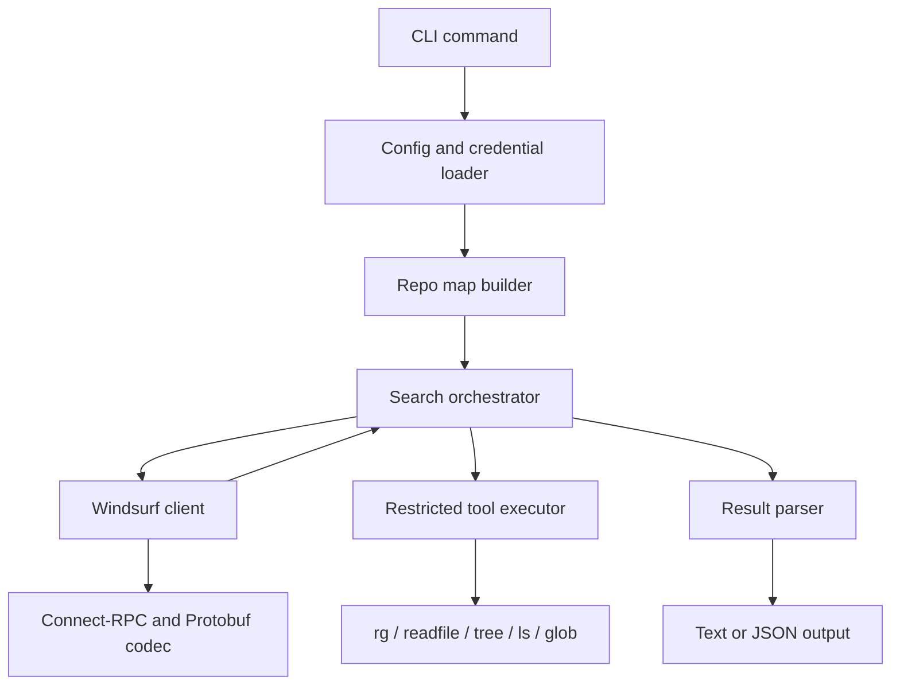

# fast-context Go CLI 技术架构方案

## 1. 结论

参考 `SammySnake-d/fast-context-mcp` 改写为 Go 版 CLI 是可行的，但不是简单把 MCP server 换成命令行入口。真正复杂度集中在 Windsurf 私有 Connect-RPC/Protobuf 协议、认证链路、远端模型与本地受限工具的多轮交互，以及跨平台凭据读取。

总体复杂度建议评为中高：

| 范围 | 复杂度 | 原因 |
| --- | --- | --- |
| 只做 CLI 外壳 | 低 | MCP 层本身很薄，Go 命令行入口容易替换 |
| 实现同等搜索能力 | 中高 | 需要完整移植协议编码、认证、流式响应解析、搜索回合编排 |
| 达到可发布跨平台工具 | 高 | 需要处理 Windows/macOS/Linux 凭据、ripgrep 分发、协议漂移、错误诊断 |

推荐使用 Go 实现核心能力，并把 MCP 兼容层作为后续可选子命令，而不是 MVP 必需项。

## 2. 参考实现快照

上游仓库：`https://github.com/SammySnake-d/fast-context-mcp`

本次评估参考的上游提交：`1fb45dab4cab009fe6ab247a6beca7008cca1b1b`（GitHub v1.2.2）

> **2026-07-05 更新**：GitHub 仓库已停更在 v1.2.2；npm 包 `fast-context-mcp` 持续演进（当前 1.5.2）。
> 本项目已对齐 npm 1.5.2 的功能：bootstrap + hotspot repo map（`internal/dirscore` BM25F/probe/RRF）、
> grep keywords 本地扩展、无结果自动重试、`--include-snippets` 代码片段输出、`--tree-depth 0` 自动深度、
> 智能上下文裁剪 + 320KB preflight trim、默认 exclude 合并、FC_* 环境变量配置、key 截断自愈。
> 后续对齐请以 `npm pack fast-context-mcp@latest` 解包内容为基准，而不是 GitHub 仓库。

上游当前是 Node.js MCP server：

| 文件 | 作用 |
| --- | --- |
| `src/server.mjs` | MCP 工具注册，暴露 `fast_context_search` 和 `extract_windsurf_key` |
| `src/core.mjs` | 搜索主流程、Windsurf 认证、Connect-RPC 请求、响应解析、回合控制 |
| `src/executor.mjs` | 本地受限命令执行：`rg`、`readfile`、`tree`、`ls`、`glob` |
| `src/protobuf.mjs` | 手写 Protobuf 编码/解码和 Connect-RPC frame 处理 |
| `src/extract-key.mjs` | 从本地 Windsurf/Devin 配置与 SQLite 数据库提取 API key |

上游依赖包括 `@modelcontextprotocol/sdk`、`@vscode/ripgrep`、`sql.js`、`tree-node-cli` 和 `zod`。其中 MCP SDK、Zod 可以在 CLI 化后移除；其余能力需要用 Go 重新实现或替代。

## 3. 目标范围

MVP 目标是一个可独立运行的 Go CLI：

```powershell
fast-context search "where is auth handled" --project . --tree-depth 3 --max-turns 3 --max-results 10
fast-context search "database connection pool" --project E:\Project\GoLand\sub2api --format json
fast-context key extract
fast-context doctor
```

MVP 必须保持的功能：

| 功能 | Go CLI 对应设计 |
| --- | --- |
| 自然语言代码搜索 | `fast-context search <query>` |
| 指定项目路径 | `--project`，默认当前目录 |
| 控制 repo map 深度 | `--tree-depth 1..6` |
| 控制远端搜索轮数 | `--max-turns 1..5` |
| 控制返回文件数量 | `--max-results 1..30` |
| 排除大目录 | `--exclude node_modules --exclude dist` |
| 自动读取 API key | 环境变量优先，本地凭据兜底 |
| 返回文件和行号范围 | 默认 text，另提供 `--format json` |
| 诊断信息 | 输出 tree size、实际 depth、timeout、错误类型和建议 |

非 MVP 范围：

| 功能 | 建议 |
| --- | --- |
| MCP server 兼容 | 后续作为 `fast-context mcp serve` 子命令实现 |
| GUI/TUI | 暂不做 |
| 自建语义索引 | 暂不做，保持 Windsurf Devstral 搜索模式 |
| 替换为其它 LLM provider | 暂不做，会改变核心产品语义 |

## 4. 总体架构



推荐目录结构：

```text
cmd/fast-context/main.go
internal/cli/
internal/config/
internal/credentials/
internal/repomap/
internal/executor/
internal/windsurf/
internal/protowire/
internal/search/
internal/output/
internal/version/
```

模块职责：

| 模块 | 职责 |
| --- | --- |
| `internal/cli` | 参数解析、子命令、退出码、用户可读错误 |
| `internal/config` | 读取 `FC_*` env 和 flag 默认值，并严格解析用户级 JSON 配置 |
| `internal/credentials` | 按优先级解析 `FAST_CONTEXT_KEY`、本地 JSON、`WINDSURF_API_KEY`、Devin CLI TOML 和 Windsurf/Devin `state.vscdb` |
| `internal/repomap` | 生成 `/codebase` 虚拟树，自动 depth fallback |
| `internal/executor` | 受限本地命令执行和路径沙箱 |
| `internal/windsurf` | 认证、JWT 缓存、rate limit 检查、流式请求 |
| `internal/protowire` | 无 `.proto` 场景下的 Protobuf wire 编码和 Connect frame |
| `internal/search` | 多轮搜索编排、工具调用回填、force-answer 逻辑 |
| `internal/output` | text/json 输出、错误诊断、敏感信息脱敏 |

## 5. 核心数据流

`search` 命令执行流程：

1. 解析 CLI 参数并确定 `projectRoot`。
2. 读取 API key：按 `FAST_CONTEXT_KEY` → `$HOME/.config/fast-context/config.json` → `WINDSURF_API_KEY` → 本地 Devin/Windsurf 凭据解析。
3. 通过认证接口换取 JWT，并按 JWT `exp` 做内存缓存。
4. 调用 rate limit 检查接口，失败则直接返回可读错误。
5. 构造项目目录树，过大时自动降低 `tree_depth`。
6. 构造 system prompt、tool schema 和用户消息。
7. 向 Windsurf Devstral stream 接口发起 Connect-RPC 请求。
8. 解析响应中的 `[TOOL_CALLS]restricted_exec[ARGS]{...}`。
9. 在本地执行受限命令，并把结果作为 tool result 发回模型。
10. 重复 `max_turns` 轮，最后注入 force-answer prompt。
11. 解析 `<ANSWER>` XML，输出文件路径、行号范围和 grep keywords。

## 6. Go 实现关键点

### 6.1 CLI 层

建议使用 `spf13/cobra` 或标准库 `flag`。如果只做 3 个子命令，标准库也足够；如果后续要加 `mcp serve`、completion、config 子命令，建议直接用 `cobra`。

建议命令：

```text
fast-context search <query>
fast-context key extract
fast-context doctor
fast-context version
```

建议全局 flag：

| Flag | 默认值 | 说明 |
| --- | --- | --- |
| `--project` | `.` | 项目根目录 |
| `--tree-depth` | `3` | 初始 repo map 深度 |
| `--max-turns` | `3` | 搜索回合数 |
| `--max-results` | `10` | 返回文件数量 |
| `--timeout` | `30s` | 单次 Windsurf stream timeout |
| `--exclude` | 空 | 可重复传入 |
| `--format` | `text` | `text` 或 `json` |
| `--verbose` | `false` | 打印进度和诊断 |

### 6.2 Protobuf 与 Connect-RPC

这是移植中最重要的模块。

上游没有 `.proto` 文件，使用手写 encoder 按字段号写 Protobuf wire format。Go 版有两种选择：

| 方案 | 评价 |
| --- | --- |
| 继续手写 varint/tag/length-delimited | 依赖最少，可完全贴合上游，但测试要求高 |
| 使用 `google.golang.org/protobuf/encoding/protowire` | 仍然不需要 `.proto`，但可减少低级编码错误 |

推荐使用 `protowire`，并为每个请求生成 golden bytes 测试。

必须复刻的协议点：

| 协议点 | 说明 |
| --- | --- |
| Auth endpoint | `https://server.self-serve.windsurf.com/exa.auth_pb.AuthService/GetUserJwt` |
| API endpoint | `https://server.self-serve.windsurf.com/exa.api_server_pb.ApiServerService/GetDevstralStream` |
| Unary content type | `application/proto` |
| Streaming content type | `application/connect+proto` |
| Connect frame | 1 字节 flags + 4 字节 big endian length + payload |
| 压缩 | 请求/响应需要处理 gzip |
| 响应解析 | 从 frame 中提取字符串，再解析 `[TOOL_CALLS]...` |

Go 模块建议：

```go
type Encoder struct {
    buf []byte
}

func (e *Encoder) String(field protowire.Number, value string)
func (e *Encoder) Bytes(field protowire.Number, value []byte)
func (e *Encoder) Message(field protowire.Number, msg []byte)

func EncodeConnectFrame(proto []byte, gzip bool) ([]byte, error)
func DecodeConnectFrames(raw []byte) ([][]byte, error)
```

### 6.3 Windsurf client

`internal/windsurf` 负责所有远端交互，避免协议细节泄漏到搜索编排层。

建议接口：

```go
type Client interface {
    FetchJWT(ctx context.Context, apiKey string) (string, error)
    CheckRateLimit(ctx context.Context, apiKey, jwt string, model string) (bool, error)
    GetDevstralStream(ctx context.Context, req Request, timeout time.Duration) ([]byte, error)
}
```

错误需要分类：

| 错误码 | 判定 |
| --- | --- |
| `AUTH_ERROR` | HTTP 401/403 或 JWT 获取失败 |
| `RATE_LIMITED` | HTTP 429 或 rate limit 检查失败 |
| `PAYLOAD_TOO_LARGE` | HTTP 413 或服务端 payload 相关错误 |
| `TIMEOUT` | context deadline / client timeout |
| `NETWORK` | DNS、TLS、连接失败 |
| `PROTOCOL` | frame/protobuf/response parse 失败 |

unary 响应压缩由 Go `http.Transport` 负责：调用方不得手动设置 `Accept-Encoding: gzip`，否则标准库不会透明解压 gzip 响应，压缩字节会被误交给 protobuf 解析器。`Content-Encoding: gzip` 仅在请求体确实压缩时设置；streaming path 继续使用自己的 Connect frame 压缩契约。

上游 Node 代码会在 TLS 失败后自动禁用证书校验。Go 版不建议默认复制这个行为，建议改为显式 `FC_INSECURE_TLS=1` 才允许关闭校验，并在输出里明确提示。

### 6.4 本地受限工具执行

CLI 的安全边界应与上游一致：远端模型不能执行任意 shell，只能请求结构化命令。

支持命令：

| 命令 | Go 实现 |
| --- | --- |
| `rg` | 调用 ripgrep 二进制 |
| `readfile` | Go 读取 UTF-8 文本，按 1-based inclusive 行号返回 |
| `tree` | Go 自己遍历目录并格式化树 |
| `ls` | Go `os.ReadDir` |
| `glob` | `doublestar` 或自实现递归 glob |

路径安全要求：

1. 远端只能看到 `/codebase` 虚拟路径。
2. 所有路径都必须映射回 `projectRoot` 内部。
3. `..`、绝对路径逃逸、symlink 逃逸需要拒绝或规范化后检查。
4. `rg` 必须使用参数数组执行，禁止拼接 shell 命令。
5. `RIPGREP_CONFIG_PATH` 应清空，避免用户本地 rg 配置污染结果。

ripgrep 分发建议：

| 方案 | 优点 | 缺点 |
| --- | --- | --- |
| 依赖系统 `rg` | 实现最快 | 不满足“无系统依赖”的上游体验 |
| 发布包内携带 per-platform `rg` | 行为最接近上游 | release 流程更复杂 |
| 纯 Go 搜索替代 | 单文件发布简单 | regex、ignore、性能和输出行为难完全一致 |

推荐 MVP 先查找内置/旁路 `rg`，找不到再查 PATH；发布阶段用 GoReleaser 打包 per-platform ripgrep。

### 6.5 凭据读取

运行时凭据优先级为：

1. `FAST_CONTEXT_KEY`
2. `$HOME/.config/fast-context/config.json` 的 `api_key`
3. `WINDSURF_API_KEY`
4. 本地 Devin/Windsurf 凭据：Linux/WSL Devin CLI `~/.local/share/devin/credentials.toml`，以及各平台的 Windsurf/Devin `state.vscdb`

固定 JSON 配置只接受 `api_key` 字段，使用 `encoding/json` 的 `DisallowUnknownFields` 严格解析。文件不存在或空 `api_key` 继续低优先级解析；读取失败、损坏 JSON、未知字段和尾随 JSON 文档直接报错。`FAST_CONTEXT_KEY` 与 JSON key 疑似被 `$` 截断时直接报错，旧 `WINDSURF_API_KEY` 保留本地凭据自愈。

SQLite 实现建议：

| 方案 | 评价 |
| --- | --- |
| `modernc.org/sqlite` | 纯 Go，无 CGO，跨平台发布简单，推荐 |
| `github.com/mattn/go-sqlite3` | 成熟但需要 CGO，Windows 交叉编译麻烦 |

读取 `state.vscdb` 时查询：

```sql
SELECT value FROM ItemTable WHERE key = 'windsurfAuthStatus'
```

再从 JSON 字段中取 `apiKey`。如果数据库被应用占用，Go 版可以先复制到临时文件再只读打开，以接近上游 `sql.js` 读文件快照的行为。

### 6.6 搜索编排

`internal/search` 负责把远端模型和本地工具串起来。

建议核心类型：

```go
type Options struct {
    Query       string
    ProjectRoot string
    TreeDepth   int
    MaxTurns    int
    MaxCommands int
    MaxResults  int
    Timeout     time.Duration
    Exclude     []string
}

type Result struct {
    Files      []ResultFile `json:"files"`
    RgPatterns []string     `json:"rg_patterns,omitempty"`
    Meta       Meta         `json:"meta"`
}

type ResultFile struct {
    Path   string      `json:"path"`
    Ranges []LineRange `json:"ranges"`
}
```

需要保留的行为：

1. 初始消息包含 problem statement 和 repo map。
2. 每轮远端只能调用一次 `restricted_exec`，但其中可包含多个 `commandN`。
3. 本地并发执行这些命令。
4. 如果远端没有生成有效命令，可补偿最多 2 轮。
5. 最后一轮注入 force-answer prompt。
6. 解析 `<ANSWER>` XML，忽略越界/不存在文件，返回真实路径。
7. 输出去重后的 grep keywords。

### 6.7 输出格式

默认 text 输出应贴近上游：

```text
Found 3 relevant files.

  [1/3] E:\Project\example\internal\auth\service.go (L12-80, L130-160)
  [2/3] E:\Project\example\internal\auth\middleware.go (L1-90)
  [3/3] E:\Project\example\cmd\server\main.go (L40-75)

grep keywords: AuthService, RequireAuth, token

[config] tree_depth=3, tree_size=12.5KB, max_turns=3, max_results=10, timeout_ms=30000
```

JSON 输出用于脚本和 agent 集成：

```json
{
  "files": [
    {
      "path": "E:\\Project\\example\\internal\\auth\\service.go",
      "ranges": [{"start": 12, "end": 80}]
    }
  ],
  "rg_patterns": ["AuthService"],
  "meta": {
    "tree_depth": 3,
    "tree_size_kb": 12.5,
    "max_turns": 3,
    "max_results": 10
  }
}
```

## 7. 依赖建议

| 用途 | 推荐依赖 | 说明 |
| --- | --- | --- |
| CLI | `spf13/cobra` | 多子命令更省心；也可先用标准库 |
| Protobuf wire | `google.golang.org/protobuf/encoding/protowire` | 无 `.proto` 也能安全写 wire format |
| SQLite | `modernc.org/sqlite` | 纯 Go，适合跨平台发布 |
| TOML | `github.com/pelletier/go-toml/v2` | 读取 Devin CLI credentials |
| Glob | `github.com/bmatcuk/doublestar/v4` | 支持 `**` |
| XML | 标准库 `encoding/xml` | 解析 `<ANSWER>` |
| HTTP/gzip/binary | 标准库 | 足够实现 Connect frame |

如果目标是极简依赖，可以先不用 `cobra` 和 TOML 库：CLI 用标准库，TOML API key 用正则读取。SQLite 和 glob 仍建议使用成熟库。

## 8. 测试与验证策略

必须有离线测试，不能每次依赖真实 Windsurf 服务。

| 测试类型 | 覆盖内容 |
| --- | --- |
| Golden bytes | Protobuf 字段编码、Connect frame 编解码 |
| Credential fixtures | TOML、SQLite `state.vscdb`、缺失字段、空 key |
| Executor temp repo | `rg`、`readfile`、`tree`、`ls`、`glob` 和路径逃逸 |
| Response parser | `[TOOL_CALLS]`、错误 JSON、`<ANSWER>` XML |
| Search orchestrator | mock client 返回 tool call 和 final answer |
| CLI e2e | `fast-context search --format json` 的退出码和输出 schema |

建议为测试增加内部 endpoint override，例如：

```text
FC_TEST_AUTH_BASE=http://127.0.0.1:...
FC_TEST_API_BASE=http://127.0.0.1:...
```

这两个变量只在测试构建或明确 `--allow-test-endpoints` 时启用，避免生产误连。

## 9. 里程碑

### M1：离线 CLI 骨架和本地 executor

交付：

| 交付物 | 验证 |
| --- | --- |
| `fast-context search` 参数解析 | `fast-context search --help` |
| repo map 生成 | 大目录自动 depth fallback |
| `readfile/tree/ls/glob` | temp repo 单测 |
| `rg` 调用 | 有匹配、无匹配、错误路径单测 |

### M2：凭据读取和诊断

交付：

| 交付物 | 验证 |
| --- | --- |
| `fast-context key extract` | TOML/SQLite fixture 单测 |
| `fast-context doctor` | 输出 key 来源、rg 状态、平台路径 |
| 敏感信息脱敏 | 输出只显示前后片段 |

### M3：Windsurf 协议客户端

交付：

| 交付物 | 验证 |
| --- | --- |
| JWT 获取 | mock server + 可选真实账号 smoke test |
| rate limit 检查 | mock server |
| stream 请求 | Connect frame golden test |
| 响应解析 | tool call 和 final answer fixture |

### M4：完整搜索闭环

交付：

| 交付物 | 验证 |
| --- | --- |
| 多轮 search orchestrator | mock client e2e |
| text/json 输出 | snapshot test |
| 错误分类和 hint | timeout、401、413、429 fixture |
| 真实项目 smoke test | 使用小型 repo 查询 2-3 个已知问题 |

### M5：跨平台发布

交付：

| 交付物 | 验证 |
| --- | --- |
| Windows/macOS/Linux 二进制 | GitHub Actions matrix |
| ripgrep 分发 | 每个平台 `doctor` 通过 |
| README 和安装说明 | 本地从 release 包安装验证 |

## 10. 工作量评估

以熟悉 Go、熟悉 HTTP/Protobuf wire format 的工程师估算：

| 阶段 | 乐观 | 稳妥 |
| --- | --- | --- |
| M1 本地 CLI/executor | 1-2 天 | 2-3 天 |
| M2 凭据读取 | 0.5-1 天 | 1-2 天 |
| M3 协议客户端 | 2-3 天 | 4-6 天 |
| M4 搜索闭环 | 1-2 天 | 2-4 天 |
| M5 发布与跨平台验证 | 1-2 天 | 3-5 天 |

可用 MVP：约 1-2 周。

稳定可发布版本：约 2-4 周。

最大不确定性不是 Go 代码量，而是 Windsurf 私有协议是否稳定，以及真实服务返回格式是否与 fixture 长期一致。

## 11. 风险与应对

| 风险 | 影响 | 应对 |
| --- | --- | --- |
| Windsurf 私有协议变更 | 工具突然不可用 | Golden test + 真实 smoke test + 清晰错误分类 |
| 字段号或 metadata 不完整 | 认证或搜索失败 | 初版严格对齐上游字段，避免提前“清理” |
| API key 本地路径变化 | 自动发现失败 | `doctor` 输出尝试路径，保留 env 手动注入 |
| SQLite 被锁或格式变化 | 凭据读取失败 | 复制快照读取；错误提示回退到 `WINDSURF_API_KEY` |
| ripgrep 分发复杂 | 用户安装体验变差 | MVP 允许 PATH，发布版内置 per-platform rg |
| 远端模型输出不规范 | search loop 中断 | 保留补偿轮、JSON 容错、强制 answer prompt |
| 安全边界被绕过 | 本地文件泄露或命令注入 | 路径沙箱、结构化参数、禁止 shell 拼接、敏感信息脱敏 |
| 法务/服务条款不确定 | 发布风险 | README 明确非官方工具，保留 MIT notice，评估是否适合公开分发 |

## 12. 推荐实施决策

建议按以下原则落地：

1. 先做 Go CLI 核心库，不先做 MCP server。
2. 协议层逐字段对齐上游，不在第一版做重构式“优化”。
3. 本地工具行为优先贴近上游，尤其是 `rg` 输出、line range 和 tree size fallback。
4. 所有真实网络调用都包一层接口，测试使用 mock server。
5. 输出必须同时支持人读 text 和机器读 JSON。
6. 对 API key、JWT、数据库路径、HTTP header 中的敏感信息统一脱敏。

如果后续要恢复 MCP 能力，可以在同一套 `internal/search` 上增加：

```text
fast-context mcp serve
```

这样 CLI、MCP、未来可能的 daemon 都复用同一套协议客户端和 executor，避免两套实现分叉。
