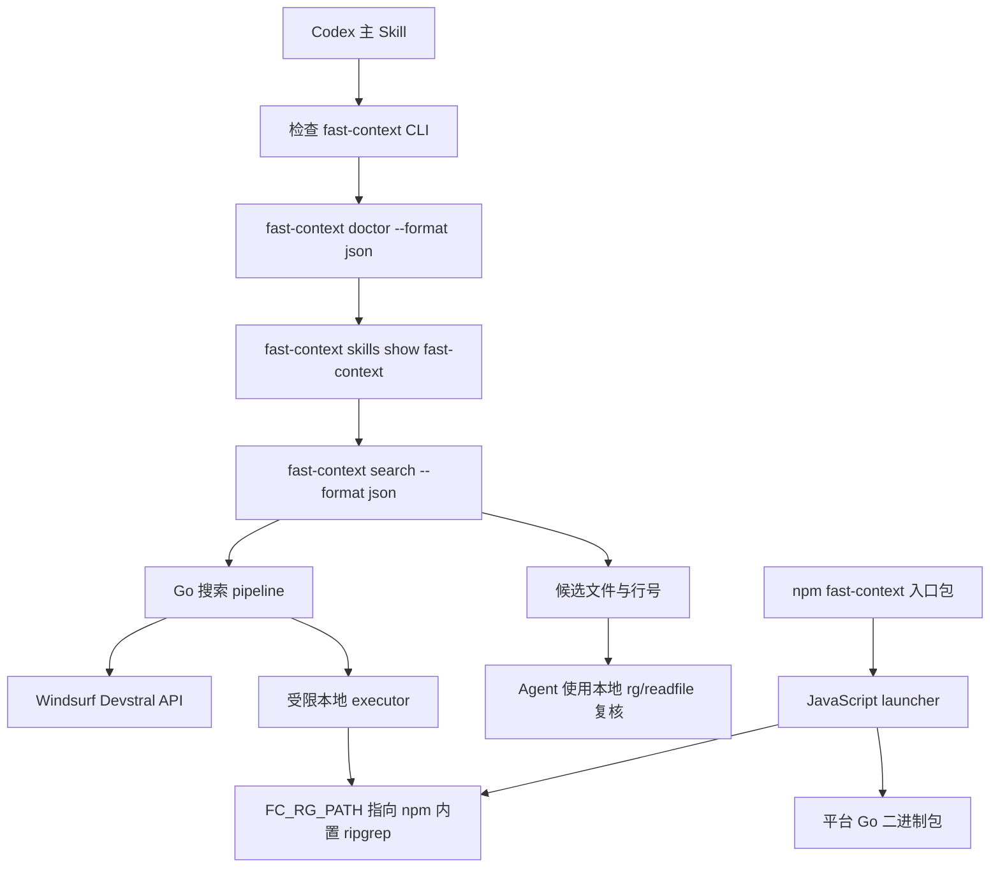

# fast-context Skill + CLI + npm 发布技术方案

## 1. 文档信息

| 项目 | 内容 |
| --- | --- |
| 文档状态 | 实施中：M0–M3 本地验证与 scoped `alpha.0` bootstrap 已完成；Trusted Publisher、干净 `alpha.1` 和真实 E2E 待完成；插件迁移按当前范围延后 |
| 目标版本 | `0.1.0-alpha.1` |
| 适用仓库 | `fast-context`，以及后续的 Codex 插件源仓库 |
| 编写日期 | 2026-07-17 |
| 关联文档 | [fast-context Go CLI 技术架构方案](./fast-context-go-cli-architecture.md) |

## 2. 结论

本项目应在保留现有 Go 搜索核心的基础上，补齐以下三层能力：

1. **CLI 能力层**：继续由 Go 二进制提供 `search`、`doctor`、凭据读取和结构化输出，并新增 Skill 分发命令与标准版本别名。
2. **npm 分发层**：使用一个入口包、三个按平台约束的二进制包和一个 JavaScript launcher，实现 `npm install -g @deqiying/fast-context` 后直接运行。
3. **Agent Skill 层**：项目内维护唯一的 `fast-context` 主 Skill，并通过薄 Codex 插件暴露触发入口；具体 CLI 契约由已安装二进制动态返回。

首版不新增 MCP Server，不复制 `onesearch` 的多 provider Skill 体系，也不同时维护 unscoped 与 scoped 两个入口别名。目标是用最小发布结构完成从 `fast-context-mcp` 到 `Skill + CLI` 的迁移。

建议发布顺序为：

```text
CLI/Skill 契约稳定
  -> npm 本地打包与跨平台安装验证
  -> [已完成] 0.1.0-alpha.0 scoped 引导发布
  -> 配置 npm Trusted Publishing
  -> 0.1.0-alpha.1 自动发布
  -> [延后] Codex 薄插件迁移与旧 MCP 路由停用
```

## 3. 背景与现状

### 3.1 已具备能力

当前仓库已经具备可复用的 Go CLI 核心：

- `cmd/fast-context/main.go` 提供单一二进制入口。
- `internal/cli` 已实现 `search`、`key extract`、`doctor`、`version`。
- `internal/search` 已实现 bootstrap、hotspot repo map、自动缩小根目录重试、grep keyword expansion 和 snippet 输出。
- `internal/credentials` 已支持环境变量与本地 Windsurf/Devin 凭据读取。
- `internal/executor` 已限制远端模型只能调用 `rg`、`readfile`、`tree`、`ls`、`glob`。
- `internal/version` 已预留 `Version`、`Commit`、`Date` 构建注入点。
- 当前代码可以在 `windows/amd64`、`linux/amd64`、`darwin/arm64` 下以 `CGO_ENABLED=0` 编译。

### 3.2 发布缺口

当前仓库尚未具备 npm 与 Skill 产品化能力：

| 缺口 | 当前表现 | 影响 |
| --- | --- | --- |
| npm manifest | 不存在 `package.json` | 无法执行 `npm pack` 或 `npm publish` |
| npm launcher | 不存在平台选择与进程转发逻辑 | npm 无法启动 Go 二进制 |
| 平台二进制包 | 不存在 `os`/`cpu` 约束包 | 无法按终端平台安装正确产物 |
| 内置 Skill | 不存在 `SKILL.md` 与 `internal/skills` | Agent 无法从 CLI 读取使用契约 |
| Codex 主 Skill | 仍依赖现有 MCP Skill 路由 | 无法完成 MCP 到 CLI 的迁移 |
| `ripgrep` 分发 | 只读取 `FC_RG_PATH` 或系统 `PATH` | npm 安装后不保证开箱即用 |
| 发布自动化 | 不存在版本文件、tag workflow 和打包脚本 | 版本和产物容易漂移 |
| 发布合规 | 不存在 `LICENSE` 和上游声明 | 不应公开发布 |
| 关键层测试 | `internal/cli`、`internal/output`、`internal/windsurf` 缺少直接覆盖 | 发布回归风险较高 |

## 4. 目标与非目标

### 4.1 目标

本方案完成后应满足：

- 用户可通过 `npm install -g @deqiying/fast-context` 安装 CLI。
- npm 安装不依赖系统预装 `rg`。
- `fast-context --version`、`fast-context doctor --format json` 可用于机器预检。
- CLI 可返回内置 Skill 清单与原始 Skill 内容。
- Codex 可通过唯一主 Skill 判断何时调用 `fast-context`，并在获得候选文件后使用本地工具复核。
- 停用旧 MCP 后，未知入口点的本地代码语义搜索仍可完整工作。
- tag 发布能够生成可审计的 npm 包和 GitHub Release 产物。
- npm tarball 不包含凭据、缓存、IDE 文件、测试临时数据或本机路径。

### 4.2 非目标

首版明确不做：

- 不恢复或新增 MCP stdio/HTTP Server。
- 不新增其它模型 provider，也不改变 Windsurf Devstral 的核心产品语义。
- 不实现 GUI、TUI、自建向量索引或后台常驻服务。
- 不为 `search`、`doctor`、`credentials` 拆分多个 Skill。
- 不自动修改用户的 Codex 配置、已安装插件缓存或 npm 全局环境。
- 不在首版支持全部 Go 交叉编译目标；npm 首发只覆盖三个已验证目标。
- 不在首版同时发布 `fast-context` 与 `@deqiying/fast-context` 两个等价入口包。

## 5. 关键设计决策

| 编号 | 决策 | 理由 |
| --- | --- | --- |
| D1 | 入口包使用 `@deqiying/fast-context` | npm 因与既有 `fastcontext` 过于相似而拒绝 unscoped 名称；organization scope 可消除名称冲突 |
| D2 | 不保留 unscoped alias 包 | 保持唯一入口包；平台包继续使用同一个 `@deqiying` scope |
| D3 | npm 首发支持 `win32-x64`、`linux-x64`、`darwin-arm64` | 与当前已验证的交叉编译矩阵一致，控制首版范围 |
| D4 | 使用 `@vscode/ripgrep` 提供 `rgPath` | 该包将平台二进制放入 npm tarball，无 `postinstall` 与运行时下载，launcher 可直接注入 `FC_RG_PATH` |
| D5 | 保留用户设置的 `FC_RG_PATH` 最高优先级 | 不破坏现有显式配置和调试能力 |
| D6 | 项目内只维护一个 `fast-context` 主 Skill | 当前能力边界单一，不需要 `onesearch` 式 provider/workflow Skill 拆分 |
| D7 | CLI 内嵌完整 Skill，Codex 插件只保留薄主入口 | CLI 是命令契约的版本化事实源，插件只负责触发与安装指引 |
| D8 | 首次引导发布与后续 OIDC 发布分开 | npm Trusted Publisher 只能为已存在的包配置，不能直接完成首次占名 |
| D9 | Alpha 阶段使用 npm dist-tag `latest` 作为默认安装渠道 | 当前接受默认安装 Alpha；稳定版仍沿用 `latest`，需要可复现安装时显式固定版本 |

## 6. 总体架构



职责边界如下：

| 层 | 负责 | 不负责 |
| --- | --- | --- |
| Codex Skill | 触发、预检、安装指引、搜索参数选择、结果复核 | 不实现搜索逻辑，不保存凭据 |
| JavaScript launcher | 选择平台包、注入 `FC_RG_PATH`、转发参数/stdio/退出码 | 不解析业务参数，不访问 Windsurf |
| Go CLI | 参数、凭据、搜索 pipeline、错误分类、结构化输出、内置 Skill | 不负责 npm 安装和 Codex 注册 |
| npm 平台包 | 保存单个平台 Go 二进制 | 不含 JavaScript 业务逻辑 |
| Codex 插件 | 向 Codex 暴露主 Skill | 不 vendoring Go/Node 源码，不管理 CLI 版本 |

## 7. 目标目录结构

```text
fast-context/
├── .deploy/
│   ├── version
│   └── release-version.ps1
├── .github/workflows/
│   └── release.yml
├── cmd/fast-context/
│   └── main.go
├── internal/
│   ├── cli/
│   │   ├── cli.go
│   │   ├── cli_test.go
│   │   └── skills_commands.go
│   ├── skills/
│   │   ├── skills.go
│   │   ├── skills_test.go
│   │   └── assets/fast-context/
│   │       ├── SKILL.md
│   │       ├── agents/openai.yaml
│   │       └── references/cli-contract.md
│   ├── version/
│   └── windsurf/
│       └── client_test.go
├── npm/
│   ├── fast-context/
│   │   ├── package.json
│   │   ├── README.md
│   │   └── bin/fast-context.js
│   └── packages/
│       ├── win32-x64/package.json
│       ├── linux-x64/package.json
│       └── darwin-arm64/package.json
├── scripts/
│   └── package-npm.ps1
├── LICENSE
├── README.md
└── go.mod
```

`dist/npm-stage` 和 `dist/npm` 是打包脚本生成的临时目录，不纳入 Git。脚本从根目录复制唯一的 `LICENSE` 到每个 staging package，避免在源码中长期维护四份许可证副本。

不在 Skill 目录增加 `README.md`、`INSTALLATION_GUIDE.md` 或重复的快速参考文件。详细命令契约只放在 `references/cli-contract.md`，主 `SKILL.md` 保持短小。

## 8. CLI 契约设计

### 8.1 根命令兼容

保留现有命令，并新增 npm CLI 的标准版本别名：

```text
fast-context search <query> [flags]
fast-context key extract [flags]
fast-context doctor [flags]
fast-context skills list [flags]
fast-context skills show <skill> [flags]
fast-context version
fast-context --version
fast-context -v
```

`version`、`--version`、`-v` 必须输出同一行构建信息并返回 `0`。

### 8.2 Skill 命令

#### `skills list`

```powershell
fast-context skills list --format json
```

稳定 JSON 结构：

```json
{
  "ok": true,
  "skills": [
    {
      "id": "fast-context",
      "aliases": ["semantic-code-search", "code-context"],
      "capabilities": ["semantic_code_search", "code_context"],
      "description": "..."
    }
  ],
  "total": 1
}
```

#### `skills show`

```powershell
fast-context skills show fast-context --format content
fast-context skills show fast-context --format json
```

- `content`：只向 stdout 输出原始 `SKILL.md`，便于 Agent 直接加载。
- `json`：输出 Skill 定义和 `content` 字段，便于程序消费。
- 未知 Skill 返回退出码 `2`，并列出可用名称。
- 该命令只读取编译进二进制的资源，不联网、不写文件。

### 8.3 `doctor` 自动化契约

在现有 JSON 上新增顶层 `ok`，并为 `ripgrep` 增加来源字段：

```json
{
  "ok": true,
  "project": {
    "path": "...",
    "exists": true
  },
  "ripgrep": {
    "ok": true,
    "path": "...",
    "source": "fc_rg_path"
  },
  "credentials": {
    "ok": true,
    "source_type": "...",
    "key": "...redacted..."
  },
  "version": {
    "version": "0.1.0-alpha.1",
    "commit": "...",
    "date": "..."
  }
}
```

约束：

- `source` 只允许 `fc_rg_path` 或 `path`。
- 不输出原始 API key、JWT、HTTP header 或 npm token。
- 保留现有 `doctor` 退出行为，首版由 Skill 读取字段判断可用性，避免无必要的兼容变更。

### 8.4 退出码和输出流

| 退出码 | 语义 | stdout | stderr |
| --- | --- | --- | --- |
| `0` | 成功 | 业务输出 | 可选进度信息 |
| `1` | 运行时、网络、认证、限流或协议错误 | JSON 模式下输出结构化错误 | text 模式下输出错误与提示 |
| `2` | 参数、未知命令或未知 Skill | 空或帮助信息 | 参数错误 |

launcher 必须原样传递子进程退出码、signal 和 stdio，不重新解释业务错误。

## 9. Skill 设计

### 9.1 Skill 名称与触发边界

Skill 名称固定为 `fast-context`。frontmatter 只包含 `name` 和 `description`。

建议的触发描述应覆盖：

- 未知入口点的本地代码语义定位。
- 业务意图到实现文件的映射。
- 架构、数据流、调用链和影响范围分析。
- 修改前的候选文件收敛。
- broad `rg` 容易产生大量噪声的场景。

明确不触发：

- 已知精确文件、symbol、配置键、错误原文或窄目录。
- 只需要确定性穷举匹配的任务。
- 用户禁止把查询或代码上下文发送到外部服务的任务。
- 公共网页、在线文档或远程 GitHub 仓库检索。

### 9.2 Skill 主流程

主 `SKILL.md` 使用命令式表达，并保持在 500 行以内：

1. 使用 `Get-Command fast-context -All` 或等价命令确认实际 CLI。
2. 运行 `fast-context --version` 验证入口和版本。
3. CLI 缺失时说明 npm 是直接安装/更新 owner；首次全局安装前取得用户授权。
4. 获得授权后安装并验证版本；Alpha 与稳定版都使用默认的 `npm install -g @deqiying/fast-context`，需要可复现安装时显式固定版本。
5. 运行 `fast-context doctor --format json` 检查项目、凭据和 `ripgrep`。
6. 在外部传输边界允许时运行 `search`；默认不加 `--include-snippets`。
7. 使用返回的文件、行号和 grep keywords 做本地确定性复核。
8. CLI 因网络、认证或服务错误不可用时，优先回退到环境中已安装且已有可用索引的本地 `codesearch`；新索引只在后台创建，当前任务不等待索引完成，没有可用索引时继续使用 `rg` 和直接文件读取。

在 mise 管理 Node 的环境中，Skill 必须区分直接 owner 与外层 runtime manager：

```text
mise -> Node/npm -> fast-context
```

诊断 CLI 安装状态时使用 `npm prefix --global`、`npm list --global --depth=0` 和直接命令解析，不把 `mise which fast-context` 作为 npm 包是否存在的决定性依据。

### 9.3 渐进式披露

| 文件 | 内容 | 加载时机 |
| --- | --- | --- |
| `SKILL.md` | 触发边界、主流程、安全边界、fallback | Skill 触发后始终加载 |
| `references/cli-contract.md` | 完整 flags、JSON schema、退出码、常见错误、回归命令 | 需要精确参数或调试时加载 |
| `agents/openai.yaml` | UI 展示元数据 | 由宿主读取，Agent 不主动加载 |

`agents/openai.yaml` 应满足：

- 字符串全部加引号。
- `display_name` 使用 `Fast Context`。
- `short_description` 保持 25–64 个字符。
- `default_prompt` 必须显式包含 `$fast-context`。
- `policy.allow_implicit_invocation` 保持 `true`。
- 不声明 MCP dependency，因为目标形态是本地 CLI。

实现阶段使用 `skill-creator` 的 `init_skill.py` 初始化目录，并使用 `generate_openai_yaml.py` 生成元数据，避免手写格式漂移。

## 10. npm 包设计

### 10.1 包清单

| 包 | 类型 | 内容 |
| --- | --- | --- |
| `@deqiying/fast-context` | 入口包 | JavaScript launcher、README、LICENSE、`@vscode/ripgrep` dependency、平台 optional dependencies |
| `@deqiying/fast-context-win32-x64` | 平台包 | `fast-context.exe` |
| `@deqiying/fast-context-linux-x64` | 平台包 | `fast-context` |
| `@deqiying/fast-context-darwin-arm64` | 平台包 | `fast-context` |

首次发布实测确认 unscoped `fast-context` 被 npm 名称相似度保护拒绝，因此入口包统一使用 `@deqiying/fast-context`，不额外保留 alias 包。`qiying` 是 npm organization `deqiying` 的 owner。

### 10.2 入口包 manifest

`npm/fast-context/package.json` 至少包含：

- `name`、`version`、`description`、`license`。
- `bin.fast-context = "bin/fast-context.js"`。
- `files = ["bin/", "README.md", "LICENSE"]`。
- `engines.node = ">=18"`。
- `repository`、`bugs`、`homepage` 指向公开仓库。
- `publishConfig.access = "public"`。
- 精确版本的 `@vscode/ripgrep` dependency；实现基线为已核对的 `1.18.0`。
- 与当前 release version 完全一致的平台 `optionalDependencies`。

依赖版本在 release 脚本中统一更新，禁止入口包和平台包出现不同版本。

### 10.3 平台包 manifest

每个平台包必须配置：

- 唯一的 `name` 和统一 `version`。
- 正确的 `os`、`cpu`。
- staging manifest 使用 `files = ["bin/", "LICENSE"]`。
- `license`、`repository`、`publishConfig.access`。
- 不声明安装脚本，不在用户机器下载二进制。

### 10.4 launcher 行为

launcher 只做以下工作：

1. 根据 `process.platform` 和 `process.arch` 选择平台包。
2. 通过 `require.resolve` 获取 Go 二进制绝对路径。
3. 从 `@vscode/ripgrep` 获取 `rgPath`。
4. 当用户没有设置 `FC_RG_PATH` 时，将其设置为 `rgPath`。
5. 使用 `spawnSync` 原样转发参数、环境、stdio、exit code 和 signal。

核心逻辑示意：

```javascript
const { rgPath } = require("@vscode/ripgrep");

const env = { ...process.env };
if (!env.FC_RG_PATH) {
  env.FC_RG_PATH = rgPath;
}

const result = spawnSync(binary, process.argv.slice(2), {
  stdio: "inherit",
  env,
});
```

错误信息必须覆盖：

- 当前平台不受支持。
- optional platform package 缺失。
- `@vscode/ripgrep` 无法解析。
- Go 二进制启动失败。
- 子进程被 signal 终止。

launcher 不得打印完整环境变量、凭据路径内容或用户查询正文。

## 11. 版本与发布流程

### 11.1 单一版本源

`.deploy/version` 是发布版本的唯一版本源。目标版本可作为位置参数传给 release 脚本，由脚本先写入该文件；不传参数时仍读取已人工修改的内容。release 脚本负责同步：

- 三个平台包的 `version`。
- 入口包的 `version`。
- 入口包中三个 `optionalDependencies` 的版本。

Go 二进制通过 `-ldflags` 注入：

```text
-X github.com/deqiying/fast-context/internal/version.Version=<version>
-X github.com/deqiying/fast-context/internal/version.Commit=<commit>
-X github.com/deqiying/fast-context/internal/version.Date=<RFC3339 timestamp>
```

### 11.2 本地发布准备脚本

`.deploy/release-version.ps1` 应：

1. 可选接收目标 SemVer 位置参数，并写入 `.deploy/version`；无参数时读取现有版本源。
2. 校验 SemVer。
3. 使用 `git status --porcelain --untracked-files=all` 拒绝无关改动。
4. 检查目标 tag 不存在。
5. 更新所有 package version。
6. 只 stage 版本相关文件。
7. 生成本地 release commit 和 tag。
8. 不自动 push、不发布 npm。

`scripts/package-npm.ps1` 应：

1. 使用仓库或临时可写的 Go/npm cache。
2. 以 `CGO_ENABLED=0` 构建三个目标。
3. 注入版本、commit 和 date。
4. 验证本机平台二进制 `--version`。
5. 在 `dist/npm-stage` 为四个包创建隔离 staging 目录，并复制 manifest、launcher/README、平台二进制和根 `LICENSE`。
6. 校验每个 staging package 中的 `LICENSE` 与根文件 SHA256 一致。
7. 只从 staging 目录执行 `npm pack`。
8. 输出 tarball 到 `dist/npm`。
9. 不执行 `npm publish`。

### 11.3 GitHub Actions

`.github/workflows/release.yml` 使用 tag `v*.*.*` 触发，至少包含：

| Job | 作用 |
| --- | --- |
| `test` | 校验版本一致性，运行 `go test ./...`、`go vet ./...` |
| `binary-build` | 构建 GitHub Release 多平台二进制与 checksums |
| `npm-build` | 构建三个 npm 平台二进制并上传 artifact |
| `npm-smoke` | 打包、临时安装入口包和当前平台包，验证命令与内置 `rg` |
| `npm-publish` | 按“平台包 -> 入口包”顺序发布 |
| `binary-release` | 创建不可变 GitHub Release |

release runner 使用 Node 24 和满足 npm Trusted Publishing 要求的 npm 版本。工作流声明 `id-token: write`，使用 GitHub-hosted runner，并确保 `package.json.repository.url` 与 npm Trusted Publisher 中配置的仓库完全一致。

### 11.4 首次发布与 OIDC 切换

npm Trusted Publisher 要求包已经存在，因此采用两阶段发布：

#### Bootstrap

1. 在本地和 CI 完成全部 dry-run/smoke。
2. 将版本设为 `0.1.0-alpha.0`。
3. 在用户明确确认后，使用交互式 npm 认证或一次性短期 granular token，手工按“平台包 -> 入口包”发布，dist-tag 使用 `next`；凭据只进入本机进程环境或受保护 secret，不写入仓库、脚本和日志。
4. 为四个 npm 包分别配置同一个 `release.yml` Trusted Publisher。
5. 若使用了短期 token，发布后立即撤销；不在仓库或 workflow 中保留长期 token 路径。

截至 2026-07-17，bootstrap 的实际结果如下：

- `@deqiying/fast-context` 与三个 scoped 平台包均已发布 `0.1.0-alpha.0`。
- 从公开 registry 安装 `@deqiying/fast-context@next` 后，`--version`、`doctor` 和内置 `ripgrep` 检查已通过。
- 已发布二进制的版本元数据包含 `-dirty`。npm 已发布版本不可覆盖，因此 `alpha.0` 只作为首次占包和安装链路验证，不补建会造成错误对齐印象的 `v0.1.0-alpha.0` Git tag。
- 当前 registry 显示四个包的 `latest` 均指向该 prerelease。经 owner 确认，Alpha 可作为默认安装版本，因此保留 `latest`，由干净的 `alpha.1` OIDC 发布自动替换默认 Alpha。
- 下一次可审计发布使用干净提交和 `0.1.0-alpha.1`，通过 Trusted Publisher/OIDC 建立 npm package、Git tag、GitHub Release 与二进制版本的一致性。

#### 正式 prerelease 流程

1. 将版本更新为 `0.1.0-alpha.1`。
2. 创建并 push `v0.1.0-alpha.1`。
3. workflow 使用 OIDC 发布并自动生成 provenance。
4. Alpha 使用 dist-tag `latest`，允许无 tag 的默认安装获得当前 Alpha。
5. 发布后将 bootstrap 遗留的 `next` alias 对齐到 `alpha.1` 或移除，避免继续指向 dirty 的 `alpha.0`。
6. 完成 Agent 迁移和真实任务验证后，再发布不带 prerelease 后缀的稳定版本；默认渠道仍为 `latest`。

发布 job 需要处理平台包已发布、入口包未发布的部分失败场景。对已存在的同版本包只能安全跳过，禁止覆盖或复用同一个版本号生成不同 tarball。

## 12. Codex 插件迁移

Codex 插件不放入 npm 包，也不在本仓库 vendoring CLI。实际插件源仓库
`my-agents-plugins` 已将普通本地 CLI 统一归入 `tool-skills`，且 Skill 必须使用
`tool-<tool-id>` 命名，因此不再新增类别重复的独立 plugin，而是在既有 plugin 中新增薄入口：

```text
plugins/codex/tool-skills/
├── .codex-plugin/plugin.json
└── skills/tool-fast-context/
    ├── SKILL.md
    ├── agents/openai.yaml
    └── assets/
```

插件 Skill 名称为 `tool-fast-context`；CLI 内嵌的事实源 Skill 仍名为
`fast-context`。薄入口只保留：

- 强触发 description。
- CLI 检查与 npm 安装指引。
- `doctor` 预检。
- `skills show fast-context --format content` 动态加载指引。
- 外部数据传输边界。
- 本地结果复核与 fallback。

迁移顺序：

1. 先发布并本地安装 npm CLI。
2. 验证 `--version`、`doctor`、`skills show` 和真实 fixture 搜索。
3. 在 `plugins/codex/tool-skills` 新增 `tool-fast-context`，将 plugin 做 minor
   版本提升，并把 `tool-codesearch` 的上游回退引用切换到新 Skill。
4. 运行仓库同步脚本生成 `plugins/claude-code` 镜像，不手工编辑镜像或
   marketplace。
5. 用新 Skill 完成独立 forward-test。
6. 确认新路由稳定后，再移除旧 `mcp-fast-context-mcp` 的广泛触发入口和 MCP 注册。
7. 已安装缓存刷新作为单独的本机验证步骤，不混入源代码提交。

过渡期不能让两个 broad semantic-search Skill 长期同时启用，否则会造成触发竞争和随机路由。

## 13. 分阶段开发计划

### M0：发布身份和合规基线

**工作内容**

- 确认 scoped 入口包 `@deqiying/fast-context` 可认领，且 `qiying` 对 organization `deqiying` 有 owner 权限。
- 记录 unscoped 名称因 npm 名称相似度保护被拒绝，不再作为发布候选。
- 增加 `LICENSE`，保留上游 MIT 版权与许可声明。
- 确定首发版本和三个支持平台。

**交付物**

- `LICENSE`
- 发布命名决策记录
- `.deploy/version`

**退出条件**

- 包名、license、repository URL 和 owner 无未决项。

**预计工作量**：0.5 人日。

### M1：内置 Skill 与 CLI 契约

**工作内容**

- 使用 `init_skill.py` 初始化 `internal/skills/assets/fast-context`。
- 编写主 `SKILL.md`、`references/cli-contract.md`。
- 生成 `agents/openai.yaml`。
- 新增 `internal/skills/skills.go` 和资源 embed。
- 实现 `skills list/show`。
- 增加 `--version`、`-v`。
- 扩展 `doctor` JSON 的 `ok` 与 `ripgrep.source`。

**交付物**

- Skill 资源和 CLI 命令
- `internal/skills/skills_test.go`
- `internal/cli/cli_test.go`

**退出条件**

- `quick_validate.py` 通过。
- `skills show --format content` 与源 `SKILL.md` 内容一致。
- CLI 测试不发起真实网络请求。

**预计工作量**：1–1.5 人日。

### M2：npm 分发层

**工作内容**

- 新增入口包、三个平台包和 launcher。
- 引入并精确固定 `@vscode/ripgrep` 基线版本。
- launcher 注入 `FC_RG_PATH`，保留用户覆盖。
- 新增 PowerShell 本地打包脚本。
- 补 npm README 的安装、支持平台和安全边界。

**交付物**

- `npm/**`
- `scripts/package-npm.ps1`
- `dist/npm/*.tgz` 本地产物

**退出条件**

- 所有包 `npm pack --dry-run --json` 通过。
- Windows 本地 tarball 全局安装通过。
- 在不依赖系统 `rg` 的前提下，`doctor` 指向 `@vscode/ripgrep` 包内路径。
- tarball 文件清单无凭据、缓存、IDE 或源码外泄。

**预计工作量**：1.5–2 人日。

### M3：测试与发布流水线

**工作内容**

- 增加 release version 同步脚本。
- 增加 GitHub Actions test/build/smoke/publish/release jobs。
- 在 `package windsurf` 的测试中复用当前可配置 `httpClient`、`apiBase` 和 `authBase` 字段建立 `httptest` seam，不为测试新增导出的生产接口。
- 增加 HTTP 状态、超时、重试、frame 解析和错误分类测试。
- 验证 Go 1.25 声明工具链和当前稳定 Go。

**交付物**

- `.github/workflows/release.yml`
- `.deploy/release-version.ps1`
- `internal/windsurf/client_test.go`

**退出条件**

- 三个平台 CI package smoke 全绿。
- package version、tag、二进制 version 完全一致。
- 发布 workflow 在 `publish` 前完成 pack content 审计。
- 不使用长期 npm write token 作为常规发布方案。

**预计工作量**：1.5–2 人日。

### M4：Codex Skill 迁移

**工作内容**

- 在插件源仓库的 `tool-skills` plugin 新增薄 `tool-fast-context` Skill。
- 更新 `tool-codesearch` fallback 引用和 `tool-skills` plugin metadata/version。
- 同步 Codex 源与声明的生成镜像。
- 验证强触发、精确查询绕过、CLI 缺失、凭据缺失和服务失败场景。
- 在用户允许时使用独立 subagent/新会话做 forward-test，避免向测试者泄露预期结论。

**交付物**

- `tool-skills` 新 minor 版本
- Skill 验证记录
- MCP 停用清单

**退出条件**

- 未知入口点请求稳定触发 `$fast-context`。
- 精确 symbol/path 请求继续优先使用本地确定性工具。
- 禁用旧 MCP 后，Skill + CLI 路径仍完成搜索。

**预计工作量**：1 人日。

### M5：预发布与稳定化

**工作内容**

- [x] 发布四个 scoped `0.1.0-alpha.0` 引导包并完成 registry 安装 smoke。
- [x] 为四个包配置 Trusted Publisher，并确认 Alpha 使用 `latest` 默认渠道。
- [ ] 通过 OIDC 发布干净的 `0.1.0-alpha.1` 并更新 `latest`。
- [ ] 对齐或移除 bootstrap 遗留的 `next` alias。
- [ ] 在公开 fixture 仓库执行经授权的真实 Windsurf E2E。
- [ ] 根据使用结果发布 patch prerelease。
- [ ] 满足稳定版门槛后发布无 prerelease 后缀的稳定版本。

**退出条件**

- npm 安装、Skill 触发、远端搜索、本地复核形成完整闭环。
- 旧 MCP 路由可安全停用。
- 已记录已知限制和回滚版本。

**预计工作量**：0.5–1 人日，不含 npm/GitHub 外部审核等待。

### 13.1 总体工作量

预计为 **6–8 人日**。其中 npm 名称认领、Trusted Publisher 配置、真实外部服务 E2E 和插件市场更新可能引入额外等待，但不应通过扩张实现范围来规避这些外部步骤。

## 14. 文件级变更矩阵

| 文件/目录 | 变更类型 | 说明 |
| --- | --- | --- |
| `internal/cli/cli.go` | 修改 | 注册 `skills`，增加版本别名，扩展 doctor JSON |
| `internal/cli/skills_commands.go` | 新增 | Skill list/show 参数和输出 |
| `internal/cli/cli_test.go` | 新增 | 根命令、Skill 命令、退出码测试 |
| `internal/skills/**` | 新增 | Skill embed、定义、读取与测试 |
| `internal/windsurf/client_test.go` | 新增 | HTTP/协议/错误分类测试 |
| `internal/version/version.go` | 保留接口 | release 通过 ldflags 注入，不新增运行时文件读取 |
| `npm/fast-context/**` | 新增 | npm 入口包和 launcher |
| `npm/packages/**` | 新增 | 三个平台包 manifest 和构建产物目录 |
| `scripts/package-npm.ps1` | 新增 | 本地构建、打包和 smoke |
| `.deploy/**` | 新增 | 单一版本源和本地 release 准备 |
| `.github/workflows/release.yml` | 新增 | CI、GitHub Release、npm Trusted Publishing |
| `README.md` | 修改 | npm 安装、Skill 使用、平台和外部传输说明 |
| `LICENSE` | 新增 | 项目和上游许可声明 |
| `my-agents-plugins/plugins/codex/tool-skills/**` | 后续跨仓修改 | 新增薄 `tool-fast-context`，更新 fallback 与 plugin metadata/version |
| `my-agents-plugins/plugins/claude-code/tool-skills/**` | 同步生成 | 由同步脚本生成 Claude Code 镜像，禁止手工编辑 |

不重写现有搜索 pipeline，不大范围格式化现有 Go 文件，不把本次发布工作扩展成 CLI framework 重构。

## 15. 测试与验收

### 15.1 自动化测试矩阵

| 类别 | 用例 | 通过标准 |
| --- | --- | --- |
| Go unit | 现有 `go test ./...` | 全部通过 |
| Go static | `go vet ./...` | 无错误 |
| Skill | `quick_validate.py` | frontmatter、命名、目录结构通过 |
| Skill embed | `skills show` 对比源文件 | 字节内容一致，统一 LF |
| CLI | help/version/unknown/skills/doctor | 退出码和 stdout/stderr 符合契约 |
| Windsurf client | `httptest` 模拟 200/401/429/500/timeout | 错误分类和重试符合预期 |
| Cross build | 三个平台 `CGO_ENABLED=0 go build` | 全部生成非空二进制 |
| npm pack | 四个包 dry-run | 文件 allowlist 正确 |
| npm install | 本地 tarball 临时 prefix 安装 | launcher 可找到平台包 |
| bundled rg | 从 npm launcher 运行 doctor | `ripgrep.source=fc_rg_path`，路径属于 npm dependency |
| Process forwarding | 子进程 0/1/2/signal | launcher 原样转发 |
| Release | tag/package/binary version | 三者完全一致 |

### 15.2 Agent forward-test 场景

| 场景 | 期望行为 |
| --- | --- |
| “用户登录鉴权在哪里实现？” | 触发 Skill，先语义定位，再本地复核 |
| “查找精确配置键 `FC_RG_PATH`” | 不调用语义搜索，直接使用 `rg` |
| CLI 未安装 | 报告缺失并在安装前请求授权 |
| CLI 已安装但凭据缺失 | 运行 doctor，给出凭据诊断，不伪成功 |
| 用户禁止外部传输 | 不调用 search，切换本地工具或报告限制 |
| Windsurf 认证失败 | 输出 `AUTH_ERROR`，不回显 key |
| npm 平台不支持 | launcher 列出支持平台并退出 `1` |
| 旧 MCP 已禁用 | 新 Skill + CLI 仍能完成公开 fixture 搜索 |

### 15.3 真实 E2E 边界

真实 `search` 会把查询、repo map 以及远端请求的受限工具结果发送给 Windsurf。预发布 E2E 必须：

- 使用公开或专门构造的 fixture 仓库。
- 在执行前获得对外传输授权。
- 不在 CI log、截图或文档中记录 API key、JWT、内部仓库内容或用户私有路径。
- 默认关闭 `--include-snippets`，只有验证 snippet 功能时在公开 fixture 上显式开启。

## 16. 安全、隐私与许可证

### 16.1 数据边界

- Go CLI 是 open-world 工具，会访问 Windsurf 外部服务。
- Skill 必须在正文中声明外部传输事实和禁用条件。
- Skill 可以在本地解析 doctor JSON，但不得把凭据候选路径、用户私有绝对路径或完整诊断对象复制到公开日志与最终答复。
- 本地 executor 继续只接受结构化受限命令，不开放任意 shell。
- 路径继续映射为 `/codebase` 并拒绝逃逸。
- launcher 不改变凭据发现逻辑，不读取 `.env`。

### 16.2 npm 供应链

- 使用严格 `files` allowlist，不依赖宽泛 `.npmignore` 兜底。
- `@vscode/ripgrep` 初始版本精确固定，升级时单独审计 tarball 和支持平台。
- 发布前保存 `npm pack --json` 结果和 SHA256。
- 正常发布使用 npm Trusted Publishing/OIDC，避免长期 write token。
- GitHub Release 生成 `checksums.txt`。
- 已发布版本不可覆盖；修复只能发布新 SemVer。

### 16.3 许可证

本项目来源实现使用 MIT License。公开发布前应：

- 在根目录增加 `LICENSE`。
- 保留上游版权和许可文本。
- 在 npm package manifest 使用与仓库一致的 SPDX license。
- 确认 `@vscode/ripgrep` 及其打包二进制的 notices 随依赖正常分发。
- 不把 `UNLICENSED` 与公开发布目标混用。

## 17. 风险与应对

| 风险 | 概率 | 影响 | 应对 |
| --- | --- | --- | --- |
| npm 名称无法认领 | 中 | 高 | unscoped 实测被拒绝后已切换为 `@deqiying/fast-context`，不保留 alias |
| 首次发布无法使用 OIDC | 高 | 中 | 使用 alpha.0 引导发布，随后立即配置 Trusted Publisher |
| Windsurf 私有协议漂移 | 中 | 高 | 增加 client fixture/golden 测试，真实 E2E 作为 release gate |
| `@vscode/ripgrep` 包体积较大 | 高 | 低 | 首版接受换取无系统依赖；后续依据真实下载数据再优化 |
| 平台 optional dependency 缺失 | 中 | 高 | launcher 给出明确重装提示，CI 在三个 OS 上安装 tarball |
| CLI 与平台包版本不一致 | 中 | 高 | 单一版本源、release preflight、精确 optional dependency |
| 新旧 Skill 触发竞争 | 高 | 中 | 迁移期短暂并存，验证后移除旧 broad MCP 入口 |
| 私有代码被用于 E2E | 低 | 高 | 只使用公开 fixture，外部传输前取得授权 |
| Go 1.25 与当前工具链行为差异 | 中 | 中 | CI 同时验证声明版本和当前稳定版本 |
| npm 全局 CLI 在 mise Node 升级后消失 | 中 | 中 | Skill 明确 npm ownership，使用 Node postinstall/重装策略恢复 |

## 18. 回滚方案

### 18.1 npm

- npm 已发布版本不覆盖、不复用。
- 有缺陷版本使用 `npm deprecate` 标记，并发布修复版本。
- Alpha 按已确认策略使用 `latest`；有缺陷版本不覆盖，发布修复版本让默认 tag 前移。
- 入口包发布失败但平台包已发布时，修复后继续发布同版本入口包；不得重发已存在平台包。

### 18.2 GitHub Release

- 不移动或覆盖已发布 tag。
- 构建失败时修复代码并创建新 prerelease tag。
- checksums 与对应 tag 保持不可变。

### 18.3 Codex 插件

- MCP 路由只在新 Skill 验收后停用。
- 新插件异常时回退到上一插件版本，并临时恢复旧 MCP 注册。
- 回滚不修改 npm 已发布版本，只调整插件路由和推荐 CLI 版本。

## 19. Definition of Done

以下条件全部满足，才认为 `Skill + CLI + npm` 改造完成：

- [x] npm 包名、owner、license 已确认。
- [x] `fast-context --version` 与 `fast-context version` 一致。
- [x] `skills list/show` 可稳定输出内置 Skill。
- [x] Skill frontmatter、正文和 `agents/openai.yaml` 验证通过。
- [x] npm 入口包与三个平台包完成 dry-run、pack 和临时安装。
- [x] npm 安装后无需系统 `rg` 即可通过 doctor。
- [x] 四个 scoped `0.1.0-alpha.0` 包已发布，公开 registry 安装与 doctor smoke 通过。
- [x] Go 单测、vet、三平台构建和 npm smoke 全部通过。
- [x] Windsurf client 离线测试覆盖关键 HTTP/协议错误。
- [ ] 公开 fixture 的真实 E2E 经授权通过。
- [ ] npm package、Git tag、GitHub Release 和二进制版本一致。
- [ ] Trusted Publisher 已为全部包配置，常规发布不使用长期 token。
- [ ] Codex `tool-fast-context` 薄 Skill 能够触发并动态读取 CLI `fast-context` Skill。
- [ ] 禁用旧 MCP 后，未知入口点搜索仍可完成。
- [x] README、安装说明、安全边界和回滚方式已更新。

## 20. 参考资料

- [本仓库 README](../README.md)
- [fast-context Go CLI 技术架构方案](./fast-context-go-cli-architecture.md)
- [Onesearch CLI 参考实现](https://github.com/deqiying/onesearch)
- [@vscode/ripgrep npm package](https://www.npmjs.com/package/%40vscode/ripgrep)
- [npm Trusted Publishing](https://docs.npmjs.com/trusted-publishers/)
- [npm provenance](https://docs.npmjs.com/generating-provenance-statements/)
- [上游 fast-context-mcp MIT License](https://raw.githubusercontent.com/SammySnake-d/fast-context-mcp/main/LICENSE)
